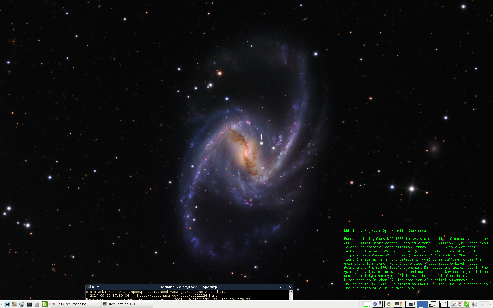

# apodwp

This utterly useless piece of software downloads the "Astronomy
Picture of the Day" along with the accompanying description off NASA's
website ([http://apod.nasa.gov/apod/](http://apod.nasa.gov/apod/), or
URL provided on command line), and installs that as the new desktop
wallpaper.

Sample screenshot:

